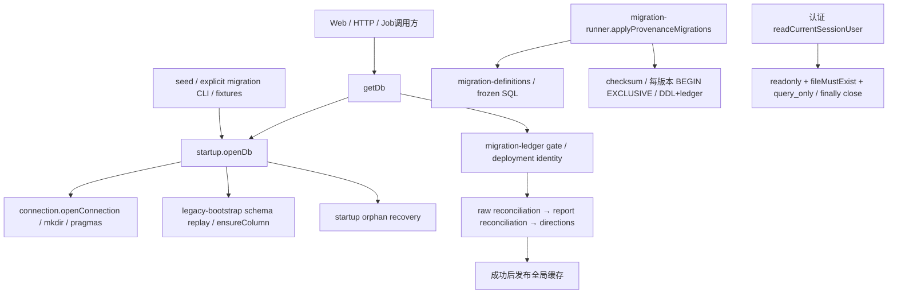

# D1 / TD-11：数据库连接、迁移与启动协调分离

基线：`origin/main` @ `c7648986d96e040dcad8c7e6dd01e75759c2bbee`。状态：用户已按建议确认 D1 四入口的协调交接及实时 WAL 引擎协调例外，B/C 分阶段实现已完成，等待最终验证与独立评审；后续合入已授权。

下一步交接核对及修复边界见 [补充方案](d1-file-handoff-and-boundary-fixes.md)。2026-10-05 用户“按照你的建议继续”作为协调确认：D1 临时独占 index.ts、provenance-migrations.ts、auth-reader.ts、local-bootstrap.ts 及拟新增模块；C1 保留 schema、恢复/删除和 ops，未来入口变更需串行交接。没有直接联系 C1 Session，不冒充其会话回复。只读验收为应用层零写入；实时 WAL 允许引擎 sidecar 协调，停写 DELETE 快照仍要求文件不变。

承接 [技术债清单](technical-debt-remediation.md)、[架构](../architecture.md)、[provenance](generation-provenance.md)、[C3](c3-model-usage-persistence.md) 和 [D4 收据](../../verify/d4-browser-smoke-2026-10-04.md)。不合入独立并行计划分支。

## 现场与归属

#404 D4、#409 认证和 #410 C3 已合入；基线 main CI 37213415190 成功。镜像发布成功不能证明上线。本任务不访问生产。

主 worktree 位于 docs/brief-information-density-plan @ 21414ab，ADR/roadmap 两处修改及四份未跟踪文档保留。C1 三个 worktree、C3、refactor-plan 和其他 worktree 均不修改；干净状态不证明会话退出。本机多 Codex 进程无法可靠映射所有会话；交接由用户作为协调者确认。C2b worktree 为 feat/c2b-task-budget，后续已出现 repos/runtime/agents 等自身改动；D1 保持这些文件零修改，不据干净状态推定会话结束。

D1 worktree `/Users/dongqiu/Dev/code/insight-agent-d1`，分支 `refactor/d1-db-lifecycle`。只复制 .env.local（0600），DATA_DIR/DB_PATH 指向该 worktree；不复制 .data、SQLite/WAL、原文、报告或 .env.development.local。

| 文件/职责 | 当前归属与 D1 边界 |
| --- | --- |
| index.ts、拟新增 connection/startup/legacy-bootstrap | 用户协调确认由 D1 临时独占 |
| provenance-migrations.ts、拟新增 migration 内容/runner/ledger 模块 | 用户协调确认由 D1 拆分；历史字节、顺序、每版本事务不变 |
| schema.ts | 事实源，D1 不修改 |
| repos.ts、planning/reports/raw-archive/deployment/model-usage | 不修改实现与接口；启动只按原次序调用 |
| runtime/预算/取消 | C2b / C2a 契约，不修改 |
| 恢复/删除模块和 ops | C1；不修改其协议，不执行恢复/历史修复 |
| package/lock、CI、Docker、共享 architecture/ADR/roadmap | 不修改；确有需要必须另行交接 |
| auth-reader.ts | 已纳入 D1，接入只读连接模块；实时 WAL 协调例外，不改认证语义 |
| D1 专属 spec、测试和验证收据 | 当前可进行，不覆盖其他切片测试 |

## 实际调用图与行为

调用入口另行核对：health 与 HTTP handlers 经 getDb 获取已发布连接；runJob 自身接受注入 DB，不隐式打开单例。显式 ops/run-provenance-migrations.ts、ops/record-deployment.ts 和受限 ops/replay-redaction-registry.ts 均仍调用 openDb + runner；local-bootstrap 供本地 seed 使用。认证 reader 接入 connection.openReadonlyDb，controller/store.ts 使用调用方独立路径和单独生命周期，不纳入 live DB 拆分。上述 ops 接线与 C1 协议默认保留；任何逐入口调整必须先交接，不批量重写调用方。

`openDb(path)` 仍是本地兼容入口：配置连接，existing content_item 时先补列，再 SCHEMA_SQL，再补列；fresh source 时安装原 v44 兼容 trigger；最后清扫 orphan。它从不调用 provenance runner，也不创建 C3 v48 表。

`getDb()` 严格模式先 openDb(bootstrap:false)，再目标 ledger 校验、deployment（除 one-shot writer）、raw/report reconciliation、默认方向，全部成功后才缓存。非严格模式保留本地 bootstrap。失败关闭当前连接并保留原错误，可重试；缓存不随 DB_PATH 改变而隐式切库，closeDb 后才重新取路径。独立 openDb 从不占用全局缓存。

现有 assertProvenanceSchema 仅校验最新版本存在和 checksum，explicit runner 校验每条已应用历史 checksum。D1 不把启动 gate 擅自加强为整本 ledger 完整性校验，也不声称缺失任意历史行都被启动拒绝；显式 runner 对缺失行尝试原迁移，错误或冲突按原契约拒绝。此差异需测试和收据明确。

## 分阶段方案

A：先固化本 spec 和 D1 专属真实文件保护测试，独立评审设计。冻结全部 48 条 checksum 与 schema object 基准；不使用新实现生成的预期值冒充历史基线。

B：把现有 provenance-migrations 拆为迁移内容、runner 和只读 ledger gate，原文件成为兼容 re-export。保持所有 SQL、版本、hash、顺序及特殊分支原文；不引入新的迁移平台或批量 repository 接线。

C：连接模块只负责创建/pragma/失败关闭和只读连接；legacy-bootstrap 容纳既有兼容迁移，startup 容纳 openDb 初始化与 getDb readiness/cache/close，index 保留原 API。认证 reader 接入只读 factory，local bootstrap 接入 startup/connection；显式 CLI 保留兼容 facade，不改 C1 ops。controller 自有数据库不接线。

采用一个 PR，B/C 两阶段在提交前分别执行回归并记录；如实际风险要求分 PR，每个切片独立验证，前置 PR 通过不代表 D1 完成。

## 反例与验收矩阵

| 边界 | 保护证据与期望 |
| --- | --- |
| 新库 / v1–v47 前缀逐版本升级 | 真实 runner 生成每个 ledger 前缀，VACUUM INTO 临时文件后重新打开升级；最终 schema objects/ledger version+checksum 与冻结新库基准相等 |
| 最新库重复 runner | schema、ledger 含 applied_at、user_version 不变 |
| 历史 hash | 既有 C3 v47 fixture + 独立基线 v48 fixture，全部 48 条一致 |
| 错 checksum / 缺 ledger | runner 错历史 checksum、startup 缺目标 ledger 明确拒绝；不改现有最新版本 gate 范围 |
| 迁移中途失败 | 用真实 SQL ledger INSERT trigger 阻断，BEGIN 成功后 DDL 和该版本 ledger 回滚，已提交前缀保留，foreign_keys 恢复；移除合成故障可重试 |
| 只读 current / old / empty / missing | 真实认证/C3 reader 不执行应用层 DDL/迁移/修复/业务写，不建库、不 mkdir；主 DB/schema/ledger/user_version 不变。实时 WAL sidecar 协调例外；DELETE 快照文件零变化，写 SQL 由 SQLite 拒绝 |
| 初始化失败 | 缺目标 ledger / deployment 错误真实拒绝；协调、schema、pragma 故障补充注入；不缓存、关闭且原错误保留，纠正后可重试 |
| 缓存 / 独立连接 | 两个临时文件不串库；缓存原路径契约保留，关闭后换库；多次 close 无错误 |
| C3 / C2a / C1 | 原 model-usage、真实 SDK/Job、取消/fencing、report-redaction、raw/report reconciliation 回归；未迁移 writer 拒绝且零 provider 请求 |
| 真实启动 / HTTP / D4 | 原 build:e2e 收据、HTTP E2E、Chromium smoke，全部合成 seed 和临时路径 |

前缀 fixture 由当前基线的真实冻结 runner 生成，不是各历史发行二进制的完整备份；另运行现有 legacy report rebuild / v42–v47 专项测试。空合成数据不能证明任意生产历史脏数据升级。故障注入不代替真实文件测试。只读静止库的字节/mtime/sidecar 检查不证明外部 writer 同时运行时整个目录无变化。

## 质量门、回退与停止条件

受影响测试及迁移集成、全 coverage/ops、TS7+TS6 app/tools、lint、build:e2e、HTTP E2E、D4 browser smoke；保留现有门，不接付费模型。

使用 eval-gate：最终 diff/回归证明 AI 参数、prompt、provider、引用/预算/业务语义及评测口径均不变后，才可理由充分地 skip。A1 不执行本拆分路径，不能证明迁移正确性。

独立新上下文 reviewer 审查方案和最终完整差异，重点历史 SQL/hash、只读、发布缓存、事务/资源、C1/C2a/C3 和夹带行为。修正后定向复查。专属收据区分本地、PR、main 和生产，按交付证据流程绑定最终候选 CI。

### 基线缺口与可见边界修复

A 阶段的失败反例保留在两份时点收据，最终验收不能拿设计评审通过替代实现通过。

1. WAL 的严格物理零写与实时变化可见性冲突：用户明确批准引擎 sidecar 协调例外；应用层仍零 DDL/迁移/修复/业务写，DELETE 离线快照文件仍零变化。保留 live WAL 密码/角色撤销可见性，不使用 immutable/exclusive。
2. v2/v13/v40 BEGIN 抢锁失败后 FK 原会留 OFF：将 FK/BEGIN 放入保护范围，只回滚本次成功 BEGIN 的事务，finally 恢复 FK；恢复错误不能遮蔽原错。历史迁移内容与特殊分支不变。
3. local bootstrap 的 runner/meta 失败原会泄漏连接：取得自有连接后，成功才转交，任一步失败关闭并保留原错。不会回滚此前已提交的迁移前缀。

这是行为保持型职责拆分附带两项已授权的失败生命周期修复，不能把资源修复声称为逐字搬移。connection 工厂增加真实连接 pragma 失败/二次清理错误测试；冻结 63 项保护测试和 4 项设计反例继续执行，按已确认 WAL 例外核对主文件/数据库状态，未使用 skip/xfail。

回退仅 revert 代码拆分，保留 schema/ledger/数据；不授权降级数据库、恢复、历史修复。用户后续已授权合入；须先完成交接/实现/独立评审和最终候选 full CI，再正常合入并核验精确 main CI；不部署、不迁移生产、不清理分支/worktree。

D2 启动实现条件：D1 对应 DB 模块已合入且精确 main CI 成功，完成文件交接；当前 PR/CI 就绪只支持 D2 调查/spec，不替代合入或生产核验。
